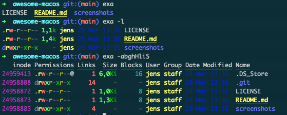

# Awesome MacOS software

## `ngrok`

## `dive`

## `ctop`

## `bat`

## `httpie`

   

A modern, user-friendly command-line HTTP client for the API era. JSON support, colors, sessions, downloads, plugins & more.

## `exa`

   

A modern replacement for `ls`.

